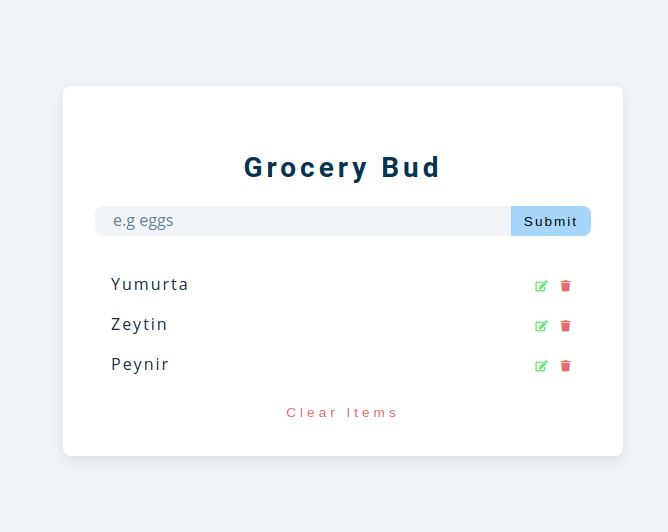

# GroceryBud

To better understand and for doing more practices about LocalStorage I followed youtube tutorial:

- [Click to see the Project](https://ayerdelen.github.io/GroceryBud)

- [For GroceryBud Tutorial](https://www.youtube.com/watch?v=3PHXvlpOkf4&t=26586s)

---

